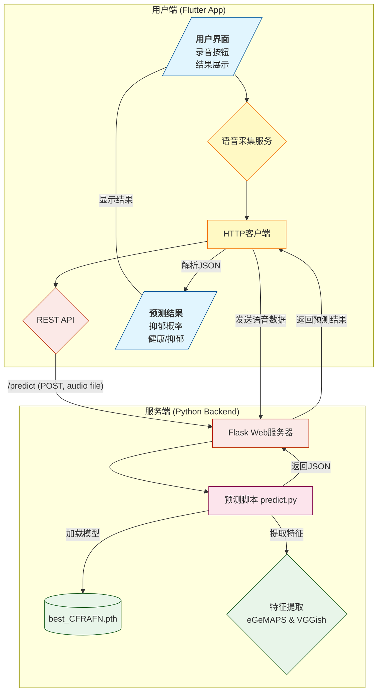

## tqdm 的两种显示模式:panda_face:tqdm.notebook​


## 显示torch关键版本


## 打印工作目录


## 下载数据集

```python
import os
from huggingface_hub import snapshot_download
)
```

## 显示显存

```python
# 显存当前内存信息
gpu_stats = torch.cuda.get_device_properties(0)
max_memory = round(gpu_stats.total_memory / 1024 / 1024 / 1024, 2)
print(f"GPU = {gpu_stats.name}. Max memroy = {max_memory} GB.")
start_gpu_memory = round(torch.cuda.max_memory_reserved() / 1024 / 1024 / 1024, 2)
print(f"{start_gpu_memory} GB of memory reserved.")
```

## Debugger 配置工作目录


## 设计抑郁症语音收集检测



